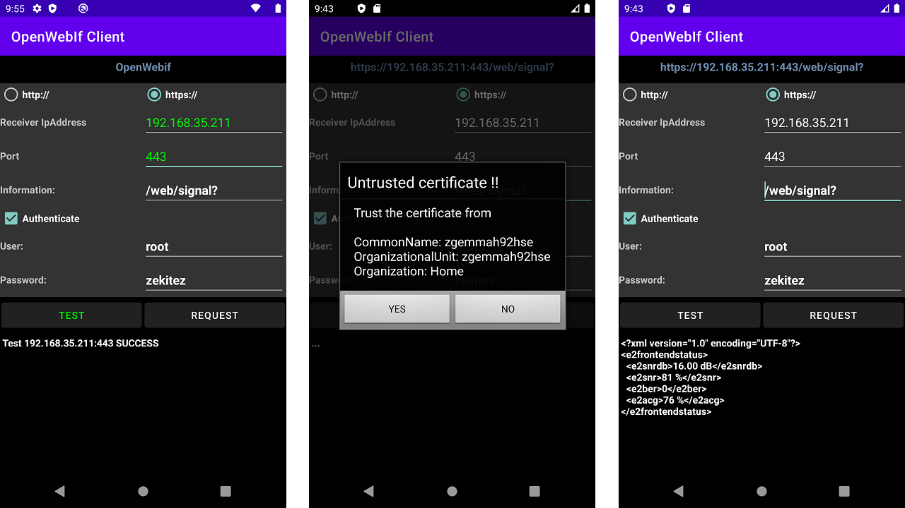
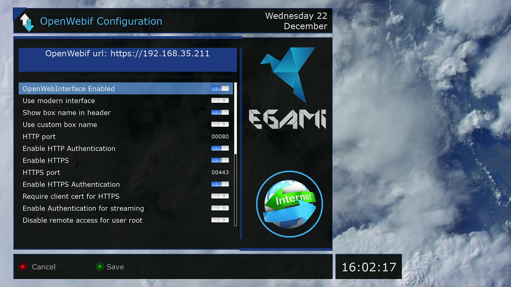

# Simple OpenWebif client in Android

I needed a minimalist app to test/study what works when you create a(n un)secure connection with the OpenWebIf server on an Enigma (Linux) satellite receiver. Optional with(out) authentication (login with user, password). Enigma receivers use for the secure connection an unique self-signed certificate. For a secure connection the self signed certificate must be trusted before you get a response.

How hard can it be to do that in Android ? I searched the internet and found many solutions, some are listed below. Secure access to the OpenWebIf server via FireFox requires trusting the self-signed certificate and authentication.

## References

.Harvesting the certificate with FireFox webbrowser, on a PC, and then use the harvest on Android. Tried it and it works but the disadvantage is: the total procedure involves some simple steps but slows you down. See  http://littlesvr.ca/grumble/2014/07/21/android-programming-connect-to-an-https-server-with-self-signed-certificate/

. Trusting any certificate. This works, is simple but does not pop the trust question. See https://www.tanelikorri.com/tutorial/android/using-self-signed-certificates-in-android/

. Memorizing Trustmanager with accepting the certificate by the user. This has all but I do not want memorizing the certificates or fall back to the default trustmanager, it is a self-signed certificate. See https://github.com/ge0rg/MemorizingTrustManager . That page has references to other solutions: NetCipher and AndroidPinning.

. Android OpenSource DreamDroid  https://github.com/sreichholf/dreamDroid . This app uses the Memorizing Trustmanager.

. OpenSource OpenWebIf  https://github.com/E2OpenPlugins/e2openplugin-OpenWebif , check the API for the controls (information) and response.

## The app

Below some screenshots of the app. Two independent buttons: TEST and REQUEST.
When the TEST button is pushed a socket is opened with the receiver IpAddress and Port. If opening the socket fails then the IpAddress and or Port is not accessable. A success or fail indication is given. When the REQUEST button is pushed and the request scheme is https the TrustManager will pop up an "Untrusted certificate !!" messages. If accepted (YES) then the response from the receiver is displayed.
Failures are also displayed so there is room to experiment with wrong input.

## OpenWebIf configuration

Configure the OpenWebIf server on the satellite receiver. The screenshot is from the Egami image which uses switches instead of a [yes|no] selection. Note that the HTTP port is always enabled when OpenWebIf is enabled. Using HTTP Authentication is then wise so unwanted visitors can not control your receiver.

1. Set OpenWebInterface enabled
2. Set the HTTP port or keep the default value of 80
3. Enable HTTP Authentication (login with user and password)
4. Enable HTTPS
5. Set the HTTPS port or keep the default value of 443
6. Enable HTTPS Authentication (login with user and password)

The receiver and Android phone must both be in the same network, in this case 192.168.35.0 .

Note that the default password for root is empty, "" but without the double-quotes, but to access OpenWebIf you have to set a root password otherwise you do not get access and a response. The root password can be set via a terminal session on a computer where you login to the satellite receiver with the ssh or rlogin command "ssh <ip_address_receiver> -l root" and set the password with the "passwd" command. That is all.

